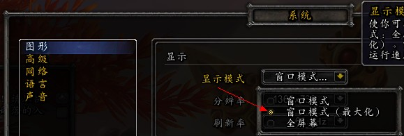
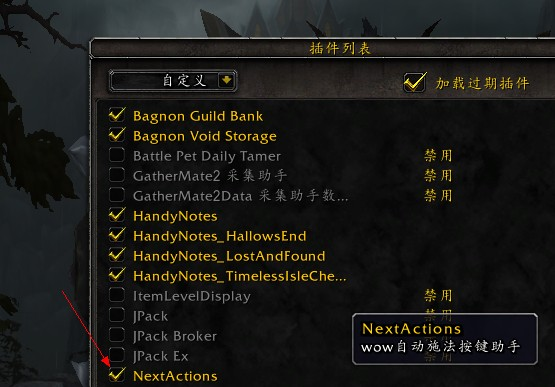
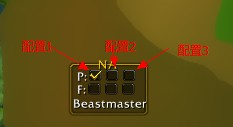
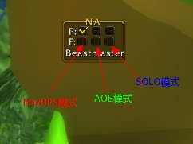
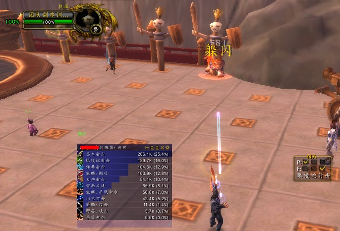

##[NextActions](https://github.com/watano/NextActions) - wow自动施法按键助手 
####作者: watano(watano@qq.com)

###为什么需要这样一个**"外挂"**呢?
wow是本人最爱的一个网游,从国服公测开始一直玩到现在, 但基本属于修仙玩家,没有参加过60年代的公会团.在wow中,经常需要长时间无脑刷怪或者随机副本,但因为工作原因,经常没有足够的时间精力,所以开发出此程序,帮助我自己刷怪刷随机副本.此程序从国服TBC时代就开始使用,后来转战台服也仍然继续使用,但一直没有开放给其他人使用,只是自己自娱自乐使用.

###运行原理
NextActions是一个标准的wow lua插件,她调用wow API分析当前游戏角色及目标状态数据,计算当前最佳施放法术, 然后在屏幕左上角的一个固定显示区域中显示法术对应的颜色块. 同时, 一个autuIt3编写的脚本程序NextActions.exe将检测屏幕左上角的固定区域中的颜色,并模拟键盘按动颜色块对应的快捷键完成法术施放.

###NextActions可以做什么？
1. 非战斗状态下,根据选择profile绑定可用法术快捷键;目前支持到36个法术的绑定,计划支持物品和宏绑定
1. 非战斗状态时,对友好目标补buff;
1. 非战斗状态时,自动对敌对目标施放伤害法术;
1. 战斗状态时,判断目标友好状态,自动施放最优增益或伤害法术;
1. 战斗状态时,根据当前玩家血量及魔法值,自动施放技能回血回蓝;
1. 玩家选择Max DPS模式时,自动施放增益法术或者开启饰品;
1. 每个职业可以有3-4个独立配置profile支持不同天赋, 3个运行模式:MaxDPS-最大化输出,一般在需要发大招时使用; AOE-A怪的时候使用; SOLO-单刷做任务的时候使用,可以自己回血,释放一些小大招,自动开怪等.

###支持wow版本 
- TBC: 法师,猎人,奶德(曾经支持过,后转战台服,没有reroll法师和猎人)
- WLK 3.3.5: 奶德(完美支持), 熊德(准完美), 树德、貓德及3系DK(可用,但dps不是最优)
- CTM 4.x: 熊德,防骑(完美支持), 惩戒骑士,貓德,树德(基本可用) 
- MOP 5.x: 完美支持血DK,冰DK,兽王LR,惩戒骑,防骑,奶骑,毁灭SS. 基本可用的有:狂暴战,防战,冰法,奥法,野德,恶魔SS.
- WOD 6.0.2: 完美支持兽王LR. 基本可用的:狂暴战,冰法,奥法,野德,血DK,冰DK,兽王LR,惩戒骑,防骑,奶骑,毁灭SS.

###使用帮助
1. 安装NextActions插件: 解压缩[NextActions.rar](https://raw.githubusercontent.com/watano/NextActions/master/NextActions.rar)到wow的Interface\AddOns\目录下, 启动wow后应该可以在插件列表中显示NextActions插件.
1. 运行NextActions.exe程序
1. **设置wow的视频选项,设置为"窗口最大化"** 注意:此选项必须选择,否则NextActions将不能正确模拟按键!

1. 运行wow,选择启用NextActions插件,并进入角色

1. 检查插件是否争取运行. 正确运行时应该在wow左上角显示一个黑色方框,同时屏幕上还会显示NextActions的主界面.

1. 界面说明: 
 - 选择当前使用的配置文件profile(每个职业目前支持3个配置,详细配置说明请参见**职业profile章节**)
 
 - 选择运行模式, 目前NextActions支持MaxDPS,AOE,SOLO 3种模式. 分别对应3个checkbox
 
1. 命令行说明:
 - /na version 或者 /na ver 输出插件版本号
 - /na toogle 切换是否启用/停用插件
 - /na 0 或 /na 1或/na 2 切换运行配置
 - */na mykey 作者自己使用的一些按键绑定,不喜欢的请不要使用. 这个不影响插件使用*
 - */na myui 作者自己使用的一些界面设定,不喜欢的请不要使用. 这个不影响插件使用*

###职业Profile
####猎人
1. 兽王猎: 目前只支持兽王天赋.暂时没有优化wow 6.0.2下的dps, 所以这个只保证可以正常使用,最大化输出就不要指望了.
 - SOLO模式下可以自动奥术射击开怪; 
 - 非MaxDPS和非战斗状态时, 自动切换到猎豹守护提高奔跑速度
 - 非战斗状态时,自动治疗宠物 
 - 兽王猎人配置5分钟测试数据: 
1. 射击天赋: 目前暂时还不支持6.0.2
1. 生存天赋: 目前暂时还不支持6.0.2

####战士
 1. 防战: 目前支持防战天赋.只保证可用
 1. 狂暴战: 支持天赋为狂暴战. 可用,但不保证最大化输出.
 1. *武器战:不可用*

####死亡骑士
 1. 双手冰DK:支持使用双手武器的冰DK.功能完备,但是还没有对wow6.x进行优化输出.
 1. 血DK:支持血天赋.功能完备,但是还没有对wow6.x进行优化输出.
 1. 双持冰DK:支持双持武器的冰DK.功能完备,但是还没有对wow6.x进行优化输出.

####圣骑士
 1. 防骑:功能完备,但是还没有对wow6.x进行优化输出.
 1. 惩戒骑:功能完备,但是还没有对wow6.x进行优化输出.
 1. *奶骑:可用,但是相当不好用,敬请期待下个版本.*

####法师
 1. *奥法:仅仅只是能用*
 1. *冰法:仅仅只是能用*
 1. *火法:暂时不可用*

####术士
 1. 恶魔术士:功能完备,但是还没有对wow6.x进行优化输出.
 1. 毁灭术士:功能完备,但是还没有对wow6.x进行优化输出.
 1. *痛苦术士:仅仅只是能用*

####德鲁伊
 1. *熊德: 仅仅只是能用*
 1. *猫德: 不可用*
 1. *恢复德: 不可用*
 1. *平衡德: 不可用*

####其他职业
*暂时不可用*

###目前已知问题
1. **只支持自动释放法术**, 使用物品和释放宏命令将在以后版本支持
1. wow 6.0.2下暂时没有优化输出序列,所以不要指望最大化输出
1. 暂时多个同类天赋技能判断不太准确,所以可以使用注释代码的方式支持多个技能
1. **战斗时不能聊天**, 因为本程序使用模拟按键方式施法,所以在战斗时会影响聊天的按键操作. 计划在以后版本中增加聊天激活检测
1. 不能记住上次释放的技能,所以会多次重复按键释放同一个法术. 目前只是做了个延时判断,并没有真正解决此问题. 计划在以后版本解决此问题.
1. 由于个人习惯问题,所以提示信息暂时都是英文的,计划在以后版本支持多语言.
1. 为了方便编写,使用dart编写了一个lua代码生成器,代码比较混乱,暂时不开放相关源代码.

###申明
1. 此代码仅仅是自娱自乐,不喜欢的请不要使用. 如需修改使用在商业用途,请给我一个帐号娱乐下,谢谢!
1. 此插件的相关源代码都已经开放源代码,有兴趣的朋友可以随意修改. 改版的请通知我一下,让我也乐呵乐呵.
1. **此插件不包含任何木马后门,但不保证其他人挂马,所以请到项目开源地址下载使用!**[NextActions](https://github.com/watano/NextActions)
1. 作者很懒,所以不要指望提交插件到各大发布网站,需要的请从项目地址下载!
1. **原则上此插件应该不会导致被暴雪封号. 如果被封号了,请及时检查自己的使用方式并通告其他人,同时也请大家为他默哀10分钟!**

###广告时间
1. 媳妇在微商卖东西,请大家支持下老婆的小店,谢谢! 媳妇的微信帐号是5044940. 公众号是"筱野"
1. 本人已经辞职在家,大家有合适的私活可以qq:77041519 推荐给我.我擅长java企业级web应用,android应用开发,微信应用开发等.目前有11年相关开发和管理经验.
1. 如果大家发现bug,可以在github的项目地址[NextActions](https://github.com/watano/NextActions)给我提交issues.
1. 如果大家喜欢这个插件,请打赏点小费支持我继续开发下去,谢谢. 我的微信帐号是:"watanoo" 
